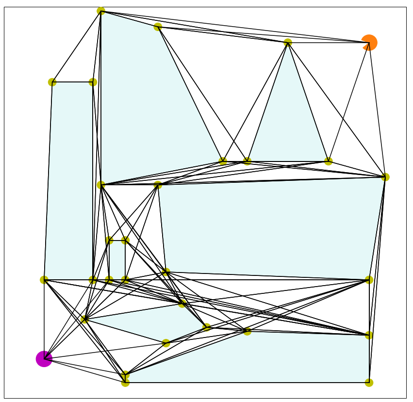
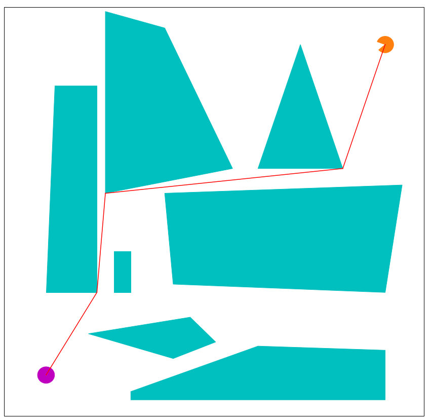

# Navigace robota ve spojitém 2D prostoru

## Implementace

Úkol jsem řešila v jazyce Python, řešení i s ukázkovým případem je přiloženém jupyter notebooku. Pro vykreslování jsem využila knihovny matplotlib, pro lepší práci s jednotlivými objekty jsem využila knihovny shapely.

## Zadání
Jako zadání jsem si vybrala navigaci robota ve spojitém 2D prostoru. Prostor obsahuje mnohoúhelníkovéé překážky, úkol robote je přesunout ze své startovní pozice do zadané cílové pozice. Uvažovala jsem bodového robota, který se pohybuje konstantní rychlostí.

odkaz na celé zadání:
https://courses.fit.cvut.cz/NI-UMI/files/MI-UMI_seminar-01_problem-solving.pdf

Ukázka prostoru:

## Definujte stavový prostor

Nejprve bylo nutné definovat stavový prostor, ve kterém je možno najít nejkratší řešení, tedy nejkratší cestu robota ze startu do cíle. 

Jednotlivé stavy tvoří vrcholy mnohoúhelníků, resp. počáteční pozice robota (počáteční stav) a cílová pozice (koncový stav). Akce z jednoho stavu do druhého tvoří takové spojnice dvou vrcholů (resp. robota/cíle a vrcholu, které nijak nekříží žádný vnitřek mnohoúhelníků. Spojice, které jsou z části tvořeny stranou mnohoúhelníka, ale nezasahující do jeho vnitřního prostoru jsou povoleny.

Ukázka stavového prostoru:

## Hledání nejkratší cesty
Na vytvořeném diskrétním stavovém prostoru jsem nejkratší cestu hledala pomocí algoritmu A*. Jako heuristiku jsem jsem vybrala eukleidovskou vzdálenost.

Ukázka řešení:

