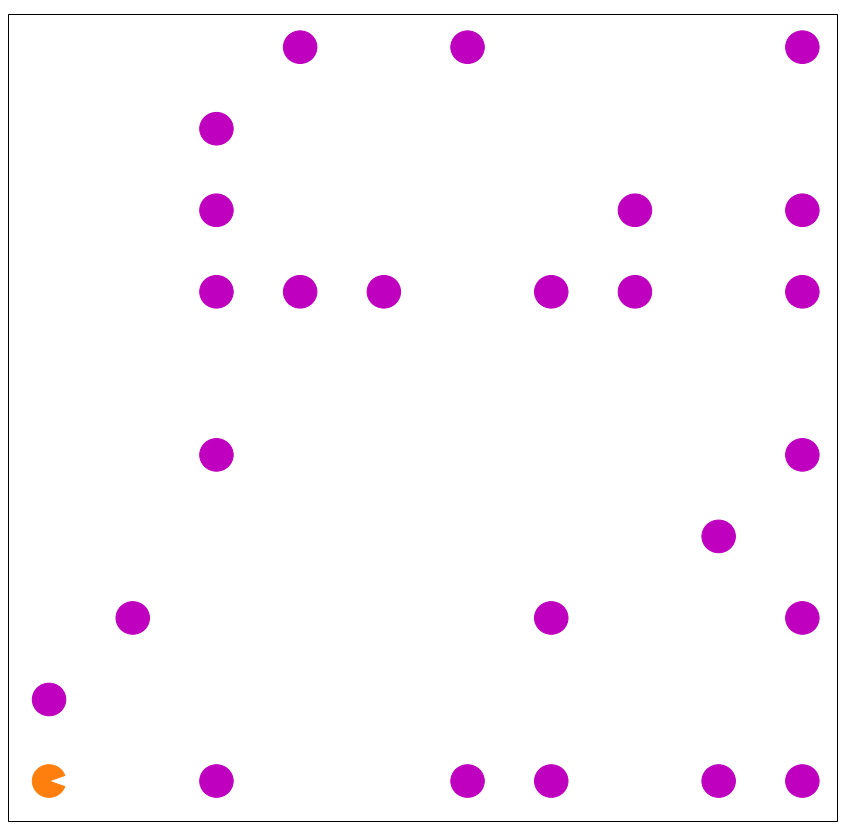

# Navygace vysavače v prostoru

## Implementace

Úkol jsem řešila v jazyce Python, řešení i s ukázkovým případem je v přiloženém jupyter notebooku. Pro vykreslování jsem využila knihovny matplotlib.

## Zadání
Jako úkol jsem si vybrala navigaci robotického vysavače v prostoru. Prostor je tvořen robotem na počáteční pozici, prázdnými místy a místy se smetím. Úkolem robota je najít co nejkratší cestu mezi jednotlivým smetím, takovou která je nejkratší možná. Jedná se tedy o přeformulovanou úlohu obchodního cestujícího.

Ukázka prostoru:

## Definujte stavový prostor

Rozhodla jsem se úlohu řešit jako nesystematické prohledávání stavového prostoru pomocí algoritmu steepest ascent hill climbing. Obecně algoritmus hill climbing nemusí najít nejlepší možné řešení, ale rozhodla jsem se jej použít, protože jsem chtěla vyzkoušet více možných přístupů k prohledávání stav. prostoru. 

Jednotlivé stavy jsou tvořeny všemi přípustnými cestami robota z počátečních souřadnic přes všechny místa se smetím. Akce jsou potom brány jako přechody mezi jednotlivými sousedními řešeními. Jako sousední řešení jsou brána taková řešení, kde se pořadí procházených míst se smetím mění pouze prohozením dvou míst se smetím v rámci cesty. Vzdálenost mezi jednotlivým smetím jsem počítala pomocí eukleidovské vzdálenosti. Jako účelová fce byla brána délka cesty tvořící řešení (tedy součet eukleidovských vzdálenosti mezi jednotlivým sousedním smetím). Pro únik z lokálního minima jsem zvolila taktiku opětovného pouštění algoritmu hill climbing z různých random vygenerovaných počátečních řešení. 

Ukázka řešení:

