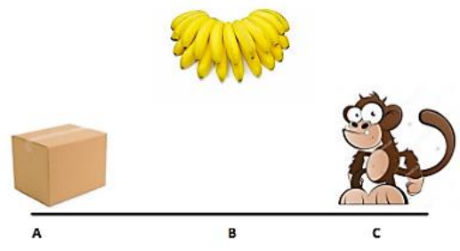

# Navigace vysavače v prostoru

## Implementace

Úkol jsem řešila pomocí PDDL řešiče v přiložených souborech jsou k patřičným podúlohám dostupné soubory příslušných definovaných domén, problémů a vygenerovaných plánů.


## Zadání
Navrhněte plánovací doménu pro úlohu s opicí a vysoko visícími banány. Opice se může
pohybovat mezi místy A, B, a C, které jsou rozmístěny v lince. Banány jsou na místě B. Dále
v úloze vystupuje krabice, která je umístěná na místě A. Opice ze země na banány nedosáhne,
ale může vylézt na krabici, ze které už na banány dosáhne. Krabicí opice může posouvat, 
přitom ale musí být na stejném místě jako krabice. Následující ilustrace ukazuje v jaké situaci
se opice na začátku nachází.

Nabízí se použít následující operátory, jejichž význam v doméně je očekávatelný a proto
uvedeme jen názvy: Go, Push, ClimbUp, ClimbDown, Grasp, Ungrasp.
a) V navržené doméně sestavte plán, kterým se opice zmocní banánů.
b) Upravte cíl tak, aby opice zmátla vědce, kteří ji pozorují, tj. zmocnila se banánů, ale
zároveň uvedla prostředí do původního stavu (krabice zpět na své místo).
c) Úlohu řešte automaticky pomocí nějakého plánovače účastnícího se soutěže IPC.
d) V prostředí se bude vyskytovat více krabic dvou typů, a sice lehké a těžké. S těžkými
opice nedokáže pohnout s lehkými ano. Modifikujte doménu, aby tyto vlastnosti
operátory zohledňovaly.



## Základní verze
V navržené doméně sestavte plán, kterým se opice zmocní banánů.


Pro řešení základní verze úlohy jsem doménu definovala následujícím způsobem:

### Predikáty:

```
(:predicates
    
        (at ?o ?p)
        (on ?m ?b)
        (over ?b ?m)
        
        (is_monkey ?m)
        (is_place ?p)
        (is_banana ?b)
        (is_box ?b)
        
        (has ?m ?o)
        
    )

```

### Akce

```
(:action go
        :parameters (?monkey ?start ?end)
        :precondition (and (is_monkey ?monkey) (is_place ?start) (is_place ?end) (at ?monkey ?start))
        :effect (and (at ?monkey ?end) (not(at ?monkey ?start)))
    )
    
    (:action push
        :parameters (?monkey ?box ?start ?end)
        :precondition (and (is_monkey ?monkey) (is_box ?box) (is_place ?start) (is_place ?end)
        (at ?monkey ?start) (at ?box ?start) (not(on ?monkey ?box)))
        :effect (and  (not(at ?monkey ?start)) (not(at ?box ?start))  (at ?monkey ?end) (at ?box ?end))
    )
    
    (:action climb_up
        :parameters (?monkey ?box ?place)
        :precondition (and (is_monkey ?monkey) (is_box ?box) (is_place ?place) (not(on ?monkey ?box)) (at ?monkey ?place) (at ?box ?place))
        :effect (and (on ?monkey ?box))
    )
    
    (:action climb_down
        :parameters (?monkey ?box ?place)
        :precondition (and (is_monkey ?monkey) (is_box ?box) (is_place ?place) (on ?monkey ?box) (at ?monkey ?place) (at ?box ?place))
        :effect (and (not(on ?monkey ?box)))
    )
    
    (:action grasp
        :parameters (?monkey ?place ?banana ?box)
        :precondition (and (is_monkey ?monkey) (is_banana ?banana) (is_place ?place) (is_box ?box) 
        (on ?monkey ?box) (over ?banana ?monkey) (at ?monkey ?place) (at ?banana ?place) (at ?box ?place) (not(has ?monkey ?banana)))
        :effect (and (has ?monkey ?banana) (not(over ?banana ?monkey)))
    )
    
    (:action ungrasp
        :parameters (?monkey ?place ?banana ?box)
        :precondition (and (is_monkey ?monkey) (is_banana ?banana) (is_place ?place) (is_box ?box) 
        (on ?monkey ?box) (at ?monkey ?place) (at ?banana ?place) (has ?monkey ?banana))
        :effect (and (not(has ?monkey ?banana)) (over ?banana ?monkey))
    )

```

Problém/Stav jsem definovala následovně:

### Objekty

```
(:objects monkey banana box place_a place_b place_c)
```

### Počáteční nastavení

```
(:init (is_monkey monkey)
           (is_banana banana)
           (is_box box)
    
           (is_place place_a)
           (is_place place_b)
           (is_place place_c)          
            
           (at box place_a)  
           (at banana place_b)
           (at monkey place_c)
           
           (over banana monkey)
           )
```

### Cíl

```
(:goal (has monkey banana)))
```
 
### Plán

```
(go monkey place_c place_a)
(push monkey box place_a place_b)
(climb_up monkey box place_b)
(grasp monkey place_b banana box)

```

## Upravte cíl tak, aby opice zmátla vědce
Upravte cíl tak, aby opice zmátla vědce, kteří ji pozorují, tj. zmocnila se banánů, ale
zároveň uvedla prostředí do původního stavu (krabice zpět na své místo).

Definice domény zůstala stejná a upravila jsem pouze cíl.
### Cíl


```
(:goal (and (has monkey banana)
                (at box place_a)
                (at monkey place_c)
        )
    )

```

### Plán

```
(go monkey place_c place_a)
(push monkey box place_a place_b)
(climb_up monkey box place_b)
(grasp monkey place_b banana box)
(climb_down monkey box place_b)
(push monkey box place_b place_a)
(go monkey place_a place_c)

```

## V prostředí se bude vyskytovat více krabic dvou typů, a sice lehké a těžké
V prostředí se bude vyskytovat více krabic dvou typů, a sice lehké a těžké. S těžkými
opice nedokáže pohnout s lehkými ano. Modifikujte doménu, aby tyto vlastnosti
operátory zohledňovaly.


Pro ukázku jsem vytvořila dvě vzorové situace. V prvním případě se na pozici C, na které je také opice nachází těžká krabice a na pozici A krabice lehká, opice tak musí dojít k lehké krabici na pozici A. V druhém případě je těžká krabice na pozici A a lehká na pozici C společně s opicí. 


Vytvořila jsem nový predikát is_heavy, a upravila akci push -- přidala jsem podmínku, že u dané krabice nesmí platit is_heavy, tedy musí se jednat o lehkou krabici.

### Plán 1. verze

```
(go monkey place_c place_a)
(push monkey box_b place_a place_b)
(climb_up monkey box_b place_b)
(grasp monkey place_b banana box_b)
```

### Pl8n 2. verze

```
(push monkey box_b place_c place_b)
(climb_up monkey box_b place_b)
(grasp monkey place_b banana box_b)
```


