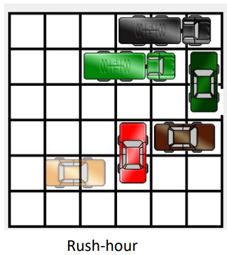
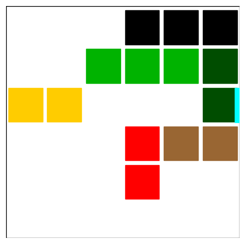
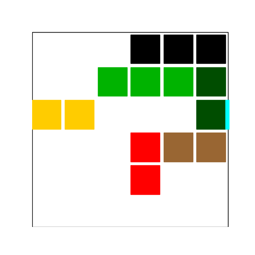

# Hra Rush-Hour

## Implementace

Úkol jsem řešila pomocí PDDL řešiče, definovaná doména, problém i plán jsou v přiložených souborech.

Přikládám ještě jupyter notebook pro genorování grafiky k vytvořenému plánu.

## Zadání
Rush-Hour – chceme auta přesouvat horizontálně a vertikálně tak, aby se žluté auto
dostalo pryč z parkoviště.



Parkoviště má rozměry 6x6 a může obsahovat auta nebo kamiony. Auta zabírají dv polička, kamiony 3.


Počáteční pozici aut jsem nechala stejnou jako je na obrázku až na žluté auto, které jsem umístila do stejného řádku jako je výjezd z parkoviště. Jelikož původní pravidla hry počítají pouze s horizontálním a vertikálním pohybem aut na parkovišti ve směru předku, resp. zadku auta a tak by se žluté auto z pozice na obrázku ven z parkoviště nikdy nedostalo.

Počáteční pozice:



## Řešení

Cílem je dostat žluté auto na pozici ((0, 3), (1, 3)) do cílové pozice u výjezdu z parkoviště ((4, 3), (5, 3)).

### Predikáty:

```
(:predicates
        (is_place ?p)
        (is_car ?c)
        (is_truck ?t)
        
        (is_occupied ?p)
        (at ?c ?p)
        (next_to ?p1 ?p2)
        (is_horizontal ?c)
        (is_vertical ?c)
        (in_same_row ?p1 ?p2)
        (in_same_column ?p1 ?p2)
        
    )

```

### Akce

Akce pro pohyb aut:

```
    (:action move_car_horizontal
        :parameters (?car ?place_a ?place_b ?to_place)
        :precondition (and (is_car ?car) (is_place ?place_a) (is_place ?place_b) 
                            (is_horizontal ?car) (next_to ?place_a ?place_b) 
                            (at ?car ?place_a) (at ?car ?place_b) (not(is_occupied ?to_place))
                            (next_to ?place_b ?to_place) (in_same_row ?place_b ?to_place)
        
        )
        :effect (and (is_occupied ?to_place) (not(is_occupied ?place_a))
                    (not(at ?car ?place_a)) (at ?car ?to_place)
        )
    )


    
    
     (:action move_car_vertical
        :parameters (?car ?place_a ?place_b ?to_place)
        :precondition (and (is_car ?car) (is_place ?place_a) (is_place ?place_b) 
                            (is_vertical ?car) (next_to ?place_a ?place_b) 
                            (at ?car ?place_a) (at ?car ?place_b) (not(is_occupied ?to_place))
                            (next_to ?place_a ?to_place) (in_same_column ?place_a ?to_place)
        
        )
        :effect (and (is_occupied ?to_place) (not(is_occupied ?place_b))
                    (not(at ?car ?place_b)) (at ?car ?to_place)
        )
    )
```


Akce pro pohyb kamionů:
```
    (:action move_truck_horizontal
        :parameters (?truck ?place_a ?place_b ?place_c ?to_place)
        :precondition (and (is_truck ?truck) (is_place ?place_a) (is_place ?place_b) (is_place ?place_c)
                            (is_horizontal ?truck) (next_to ?place_a ?place_b)  (next_to ?place_c ?place_b) 
                            (at ?truck ?place_a) (at ?truck ?place_b) (at ?truck ?place_c) (not(is_occupied ?to_place))
                            (next_to ?place_c ?to_place) (in_same_row ?place_b ?to_place)
        
        )
        :effect (and (is_occupied ?to_place) (not(is_occupied ?place_a))
                    (not(at ?truck ?place_a)) (at ?truck ?to_place)
        )
    )


    
    
     (:action move_truck_vertical
        :parameters (?truck ?place_a ?place_b ?place_c ?to_place)
        :precondition (and (is_truck ?truck) (is_place ?place_a) (is_place ?place_b) (is_place ?place_c)
                            (is_vertical ?truck) (next_to ?place_a ?place_b)  (next_to ?place_c ?place_b)
                            (at ?truck ?place_a) (at ?truck ?place_b) (at ?truck ?place_c) (not(is_occupied ?to_place))
                            (next_to ?place_a ?to_place) (in_same_column ?place_b ?to_place)
        
        )
        :effect (and (is_occupied ?to_place) (not(is_occupied ?place_c))
                    (not(at ?truck ?place_c)) (at ?truck ?to_place)
        )
    )

```

Kompletní definice problému je přiloženém souboru, zde pro její obsáhlost uvedu pouze objekty a cíl:

### Objekty

```
(:objects monkey banana box place_a place_b place_c)
```

### Cíl

```
(:goal (and
        (at car_y place_53)
        (at car_y place_43)
    )
)

```
 
### Plán
Vygenerovaný plán:

```
(move_car_horizontal car_y place_03 place_13 place_23)
(move_car_horizontal car_y place_13 place_23 place_33)
(move_car_horizontal car_y place_23 place_33 place_43)
(move_car_vertical car_r place_31 place_32 place_30)
(move_car_horizontal car_b place_52 place_42 place_32)
(move_car_vertical car_g place_53 place_54 place_52)
(move_car_vertical car_g place_52 place_53 place_51)
(move_car_horizontal car_y place_33 place_43 place_53)

```
Animace vypočítaného plánu:




