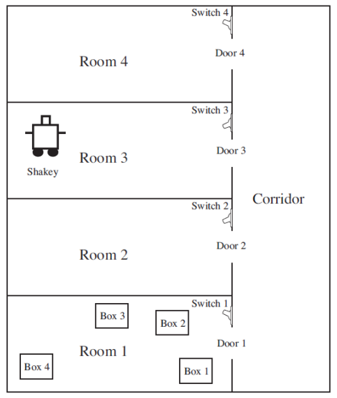

# Hra Robot Shakey

## Zadání
Robot Shakey stál u zrodu klasického plánovaní (STRIPS). Navrhněte doménu pro Shakeyho,
který působí v následujícím prostředí:



Shakey se může pohybovat mezi místnostmi a chodbou. Může rozsvítit nebo zhasnout
v místnosti pomocí vypínače. Na vypínač ale ze země nedosáhne, musí se vyšplhat na krabici,
aby dosáhnul (skutečný Shakey toto neuměl). Krabice může Shakey převážet, uveze jednu.
V navržené plánovací doméně nalezněte plán, jehož vykonáním Shakey rozsvítí v místností 4
(Room 4). Opět můžete plán hledat pomocí existující plánovače.


## Implementace

Úkol jsem řešila pomocí PDDL řešiče. Definovaná doména, problém i plán jsou v přiložených souborech.

## Řešení

Cílem je rozsvítit room 4, na to musí být v místosti robot shakey a krabice, na kterou si robot může stoupnout.

### Doména

#### Predikáty:

```
(:predicates
    
        (at ?o ?p)
        (on ?m ?b)
        (next_to ?r1 ?r2)
        (has ?r ?o)
        
        (is_robot ?r)
        (is_room ?p)
        (is_light ?b)
        (is_box ?b)
        
        (switched_on ?l)
        (robot_on_box ?r)
        (robot_has_box ?r)
        
    )


```

#### Akce

Pohyb robot z místnosti do místnosti:

```
    (:action go
        :parameters (?robot ?start_room ?end_room)
        :precondition (and (is_robot ?robot) (is_room ?start_room) (is_room ?end_room) (at ?robot ?start_room) 
        (next_to ?start_room ?end_room) (not(robot_on_box ?robot)))
        :effect (and (at ?robot ?end_room) (not(at ?robot ?start_room)))
    )
```


Manipulace s krabicemi:
```
(:action take_box
        :parameters (?robot ?box ?room)
        :precondition (and (is_robot ?robot) (is_box ?box) (is_room ?room)
        (at ?robot ?room) (at ?box ?room) (not(robot_on_box ?robot)) (not(robot_has_box ?robot)) )
        :effect (and (has ?robot ?box) (robot_has_box ?robot))
)

(:action place_box
:parameters (?robot ?box ?room)
:precondition (and (is_robot ?robot) (is_box ?box) (is_room ?room)
(at ?robot ?room) (not(robot_on_box ?robot)) (robot_has_box ?robot) (has ?robot ?box) )
:effect (and (not(has ?robot ?box)) (not(robot_has_box ?robot)) (at ?box ?room))
)

```

Lezení na krabice:
```
(:action climb_up
        :parameters (?robot ?box ?room)
        :precondition (and (is_robot ?robot) (is_box ?box) (is_room ?room) (not(on ?robot ?box)) 
        (at ?robot ?room) (at ?box ?room))
        :effect (and (on ?robot ?box) (robot_on_box ?robot) )
)

(:action climb_down
:parameters (?robot ?box ?room)
:precondition (and (is_robot ?robot) (is_box ?box) (is_room ?room) (on ?robot ?box) 
(at ?robot ?room) (at ?box ?room))
:effect (and (not(on ?robot ?box)) (not(robot_on_box ?robot)) )
)
```

Rozsvicení a zhasínání:
```
(:action switch_on
        :parameters (?robot ?room ?light ?box)
        :precondition (and (is_robot ?robot) (is_light ?light) (is_room ?room) (is_box ?box) 
        (on ?robot ?box) (at ?robot ?room) (at ?light ?room) (at ?box ?room) (not(switched_on ?light)))
        :effect (and (switched_on ?light) )
)

(:action switch_off
:parameters (?robot ?room ?light ?box)
:precondition (and (is_robot ?robot) (is_light ?light) (is_room ?room) (is_box ?box) 
(on ?robot ?box) (at ?robot ?room) (at ?light ?room) (switched_on ?light))
:effect (and (not(switched_on ?light)) )
)
```

### Problém

#### Objekty

```
(:objects 
    shakey 

    room1 room2 room3 room4 corridor
    
    box1 box2 box3 box4
    
    switch1 switch2 switch3 switch4
)
```

#### Počáteční stav

```
(:init 
	; shakey
	(is_robot shakey)

	(at shakey room3)

	; rooms
	(is_room room1)
	(is_room room2)
	(is_room room3)
	(is_room room4)
	(is_room corridor)

	(next_to room1 corridor) 
	(next_to corridor room1)

	(next_to room2 corridor) 
	(next_to corridor room2)

	(next_to room3 corridor) 
	(next_to corridor room3)

	(next_to room4 corridor) 
	(next_to corridor room4)

	; boxes
	(is_box box1)
	(is_box box2)
	(is_box box3)
	(is_box box4)

	(at box1 room1)
	(at box2 room1)
	(at box3 room1)
	(at box4 room1)
	(at switch1 room1)

	(at switch2 room2)

	(at switch3 room3)

	(at switch4 room4)


	; lights
	(is_light switch1)

	(is_light switch2)
	(switched_on switch2)

	(is_light switch3)
	(switched_on switch3)

	(is_light switch4)

)
```

#### Cíl

```
(:goal (switched_on switch4))

```
 
### Plán
Vygenerovaný plán:

```
(go shakey room3 corridor)
(go shakey corridor room1)
(take_box shakey box1 room1)
(go shakey room1 corridor)
(go shakey corridor room4)
(place_box shakey box1 room4)
(climb_up shakey box1 room4)
(switch_on shakey room4 switch4 box1)

```


